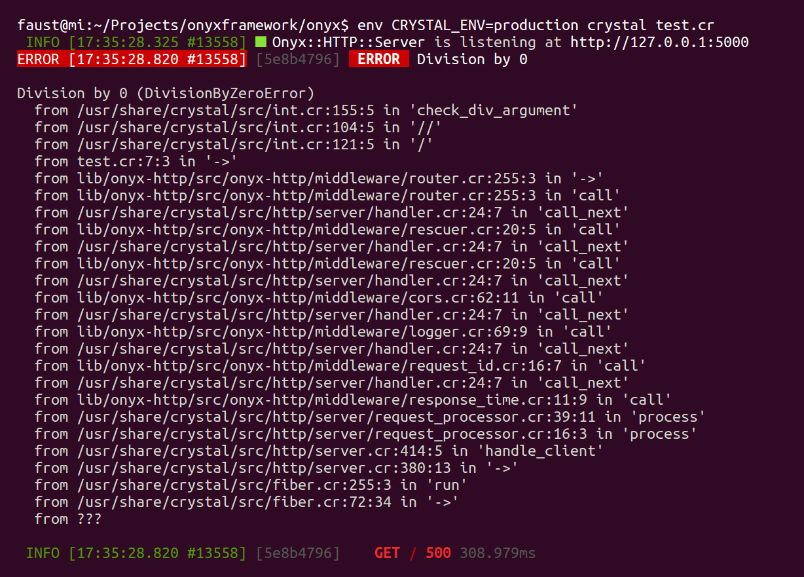
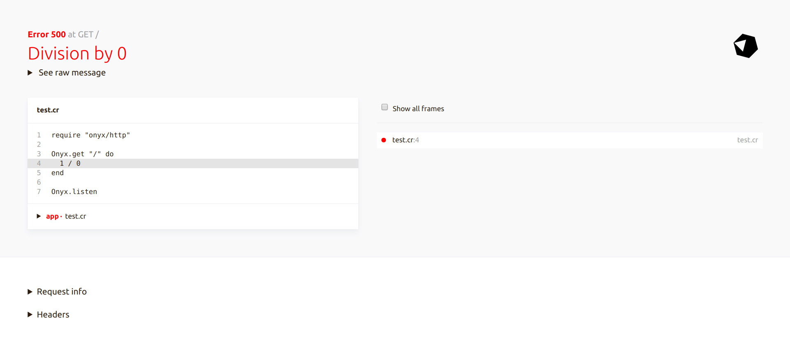

# Errors

Basically, there are two types of errors which usually occur in web applications — unexpected (i.e. [Exceptions](#exceptions)) and expected (i.e. [HTTP errors](#http-errors), for example, 404 if user is not found with given ID). Both cases are handled well with Onyx::HTTP.

## Exceptions

Whenever you experience an unhandled exception, it will be properly rescued by Onyx::HTTP and then rendered. Consider this example:

```crystal
require "onyx/http"

Onyx::HTTP.get "/" do
  1 / 0
end

Onyx::HTTP.listen
```

First of all, you'll see this error in your console log:



Then, by default, a error is rendered as a plain text:

```sh
> curl localhost:5000
500 Division By Zero Error — Division by 0

/usr/share/crystal/src/int.cr:155:5 in 'check_div_argument'
/usr/share/crystal/src/int.cr:104:5 in '//'
/usr/share/crystal/src/int.cr:121:5 in '/'
...
```

If `CRYSTAL_ENV` environment variable equals to `production`, then the sensitive part is omitted:

```sh
> curl localhost:5000
500 Internal Server Error
```

However, the rendering depends on the `"Accept"` header. The same error would look like this from browser:



And in production:


The error would also be pretty printed in JSON:

```sh
> curl localhost:5000 -H "Accept: application/json"
{
  "error":{
    "name": "Division By Zero Error",
    "message": "Division by 0",
    "code": 500,
    "payload": {
      "backtrace": [
        "/usr/share/crystal/src/int.cr:155:5 in 'check_div_argument'",
        "..."
      ]
    }
  }
}
```

And in production mode:

```sh
> curl localhost:5000 -H "Accept: application/json"
{
  "error": {
    "name": "Internal Server Error",
    "message": null,
    "code": 500,
    "payload": null
  }
}
```

## HTTP errors

Most of the time you'll have so called *expected* errors in your application. For example, when a user cannot be found by ID provided as path param, a 404 HTTP error should be returned. You can print such a error manually into the response like this:

```crystal
Onyx::HTTP.get "/users/:id" do |env|
  user? = Onyx::SQL.query(User.where(id: env.request.path_params["id"].to_i)).first?

  if user = user?
    return Views::User.new(user)
  else
    env.response << "400 User Not Found"
  end
end
```

But what about rendering this error in JSON or HTML? For better control flow and less boilerplate code using `HTTP::Error` is recommended:

```crystal
class UserNotFound < Onyx::HTTP::Error(404)
end

Onyx::HTTP.get "/users/:id" do |env|
  user = Onyx::SQL.query(User.where(id: env.request.path_params["id"].to_i)).first?
  raise UserNotFound.new unless user

  return Views::User.new(user)
end
```

Such errors are rendered nicely depending on the `Accept` header as well:

```sh
> curl localhost:5000/users/42
404 User Not Found
```

```sh
> curl localhost:5000/users/42 -H "Accept: application/json"
{
  "error": {
    "name": "User Not Found",
    "message": null,
    "code": 404,
    "payload": null
  }
}
```


The HTTP errros are rendered **equally** in production mode. They also do not appear in the logs.

A error can have a custom message and/or payload:

```crystal
class UserNotFound < Onyx::HTTP::Error(404)
  def initialize(@id : Int32)
    super("User not found with ID #{@id}")
  end

  def payload
    {id: @id}
  end
end

Onyx::HTTP.get "/users/:id" do |env|
  id = env.request.path_params["id"].to_i

  user = Onyx::SQL.query(User.where(id: id)).first?
  raise UserNotFound.new(id) unless user

  return Views::User.new(user)
end
```

```sh
> curl localhost:5000/users/42
404 User Not Found — User not found with ID 42
```

```sh
> curl localhost:5000/users/42 -H "Accept: application/json"
{
  "error": {
    "name": "User Not Found",
    "message": "User not found with ID 42",
    "code": 404,
    "payload": {
      "id": 42
    }
  }
}
```


[Endpoint](/http/endpoint) and [Channel](/http/channel) modules have convenient `.errors` macro to declare such errors swiftly. Note that Channel errors are rendered within the channel itself, but still logged.
